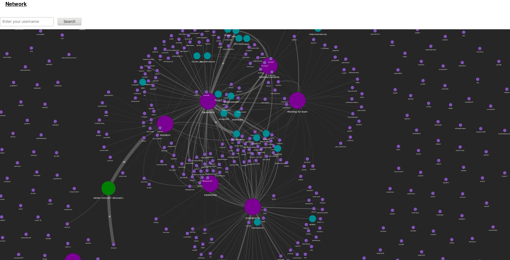

# Slack Explorer
The Slack workspace is represented as a network graph. Big nodes represent channels or private chats, smaller ones represent admins, and smaller still are regular users. Edges represent at least one message sent from a user to a channel or chat. Thicker edges represent a user being more active in that channel.

The graph forms new edges and updates existing ones in real time.

Users can select a given channel or user to view only nodes and edges connected to that node. This allows much more precise exploration of the very complex system.

Word clouds are generated both for each channel and for each user, as well as a line graph representing activity over time.

We think this would hook in really nicely with a sentiment/tone API so we could see the mood in the channels, and reflect that using colour.

Finally, since we log all the activity over time in a database, we have the potential "replay" the network's evolution over time, which would be really cool.

# How to run

You must have `ts-node` and `typescript` installed globally.

1. Run `mongod` (requires version >= 3.6)
2. Populate the database with `npm run fetch` (also wipes the existing database)

Start TSC in watch mode:
`npm run watch-ts`

Then, in a SEPARATE terminal, run the backend:
`npm run dev`

It should restart automatically on any code change.